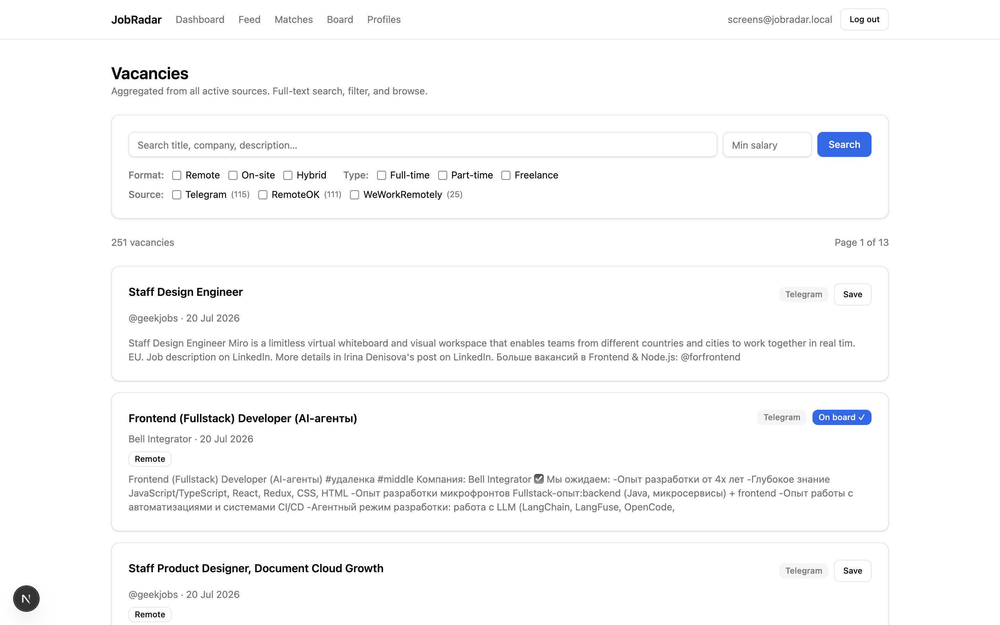
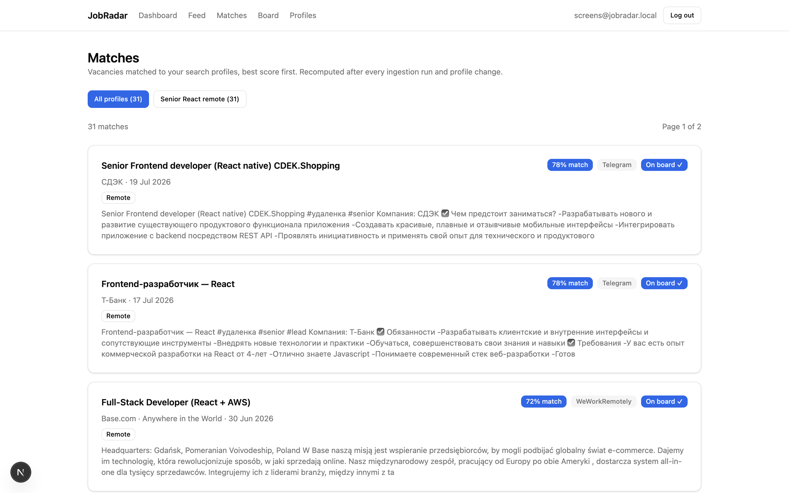
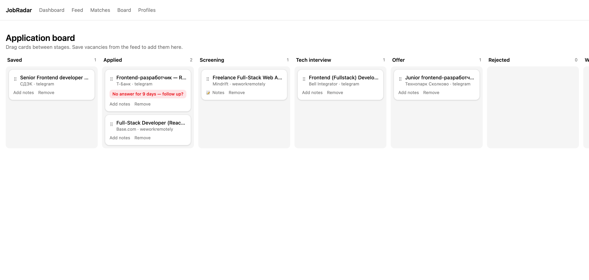
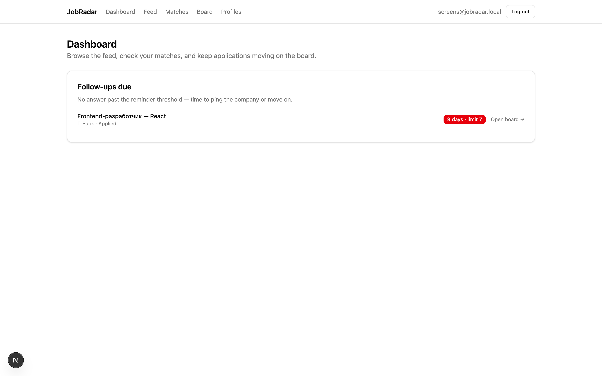

# JobRadar

> Personal job-search service: a vacancy aggregator with a built-in application-tracking CRM.

**Status:** v1.0 released — in daily use by the author; next up: phase 4 apply assistant (ADR-011) · **Version:** 1.0.0 · see [CHANGELOG.md](CHANGELOG.md)

**Live:** [web](https://job-radar-web-phi.vercel.app) (Vercel) · [api /health](https://jobradar-api-ptvp.onrender.com/health) (Render, free tier — first hit after idle takes ~30–60 s)

## Screenshots

**Vacancy feed** — aggregated from Telegram job channels, RemoteOK and WeWorkRemotely every 4 hours; full-text search, format/type filters, per-source filter with counts:



**Matches** — vacancies scored against your search profiles (rules-based: hard filters + keyword/stack hits):



**Application board** — drag-and-drop kanban with notes and follow-up reminders:



**Dashboard** — follow-ups due ("no answer for N days"):



## What it is

JobRadar combines two tightly coupled parts:

1. **Aggregator** — background workers regularly collect vacancies from scraping-friendly sources (official APIs, RSS feeds, Telegram channels), filter them against the user's search profile, deduplicate them, and deliver a digest.
2. **Application CRM** — a kanban board for managing the job-search funnel: saved vacancy → applied → screening → tech interview → offer. With per-company notes and follow-up reminders.

Shipped in v1.0: email+password auth with server-side sessions, search profiles, ingestion from three sources (Telegram job channels via MTProto as primary, RemoteOK JSON, WeWorkRemotely RSS) on a 4-hour GitHub Actions cron, heuristic cross-source deduplication, Postgres FTS feed with filters, rules-based profile matching with an in-app Matches page, the kanban board with notes and reminders, and Sentry on both apps. The daily email digest is deferred until after v1.0 (matches are delivered in-app).

## Why it exists

The author is a frontend developer (React, 8 years) using this project as a path to real full-stack experience: a standalone backend with migrations, queues, cron jobs, email delivery, Docker, CI/CD, deployment, and monitoring. The secondary goal is a genuinely useful tool for the author's own job search (remote/on-site, full-time/part-time/freelance, CIS and international markets). Hypothetical monetization (a $5–10/mo subscription for other job seekers) is explicitly *not* a priority.

## Hard constraints

- **Budget: $0.** Free tiers only. The single allowed expense is a domain (~$10/year), and even that is optional.
- **No LinkedIn scraping.** Anti-bot measures make it a permanent war not worth fighting. Compensated by a browser extension for one-click manual saving (phase 4).
- **Gentle scraping everywhere else:** API/RSS-first sources, runs every few hours, caching, no proxies.

## Stack

| Layer | Choice |
|---|---|
| Frontend | React + Next.js (App Router) on Vercel |
| Backend | NestJS + TypeScript (separate service) on Render |
| Database | PostgreSQL (Neon free tier) + Postgres FTS |
| ORM | Drizzle, with migrations (ADR-008) |
| Queue / cache | Redis (Upstash free) + BullMQ |
| Cron | GitHub Actions schedule → authenticated ingestion hook (ADR-006) |
| Sources | Telegram MTProto (GramJS), RemoteOK JSON, WeWorkRemotely RSS |
| Monitoring | Sentry free tier, both apps (ADR-010) |
| CI/CD | GitHub Actions (lint + typecheck + tests) |

Full rationale for each choice: [docs/ARCHITECTURE.md](docs/ARCHITECTURE.md) and [docs/decisions/](docs/decisions/).

## Development

Requirements: Node.js ≥ 22, pnpm ≥ 11, Docker (Docker Desktop, OrbStack, or colima).

```bash
# infrastructure (Postgres 17 + Redis 8)
cp .env.example .env      # once
docker compose up -d      # start; `docker compose ps` shows health
docker compose down       # stop (add -v to also drop data volumes)

pnpm install
pnpm build       # builds packages/shared, apps/api, apps/web
pnpm dev         # runs web (http://localhost:3000) and api (http://localhost:3001) in watch mode
pnpm lint
pnpm typecheck
pnpm test
```

Note: `packages/shared` is consumed from its `dist/` output — run `pnpm build` (or `pnpm --filter @jobradar/shared build`) once before the first `pnpm dev`.

Monorepo layout: `apps/web` (Next.js), `apps/api` (NestJS), `packages/shared` (shared types/constants) — see [docs/ARCHITECTURE.md](docs/ARCHITECTURE.md).

## Documentation map

| Document | Contents |
|---|---|
| [CLAUDE.md](CLAUDE.md) | AI-assistant entry point: context rules, worklog & versioning conventions |
| [docs/PRODUCT.md](docs/PRODUCT.md) | Product vision, target user, v1.0 scope, success criteria |
| [docs/ARCHITECTURE.md](docs/ARCHITECTURE.md) | System design, repo layout, stack rationale |
| [docs/DATA_MODEL.md](docs/DATA_MODEL.md) | Database entities and relationships |
| [docs/DATA_SOURCES.md](docs/DATA_SOURCES.md) | Every ingestion source: API details, limits, politeness rules |
| [docs/ROADMAP.md](docs/ROADMAP.md) | Phase-by-phase implementation plan with checklists |
| [docs/RISKS.md](docs/RISKS.md) | Known risks and mitigations |
| [docs/decisions/](docs/decisions/) | Architecture Decision Records (ADRs) |
| [docs/WORKLOG.md](docs/WORKLOG.md) | Chronological log of work done |
| [docs/original-plan.ru.md](docs/original-plan.ru.md) | The original planning document (Russian) |

## Definition of success

- v1.0 is deployed and actually used by the author in a real job search.
- The target full-stack experience is covered: auth, DB + migrations, queues, cron, email, deploy, CI/CD, monitoring.
- The project works as a resume line: README with screenshots and a live link.
